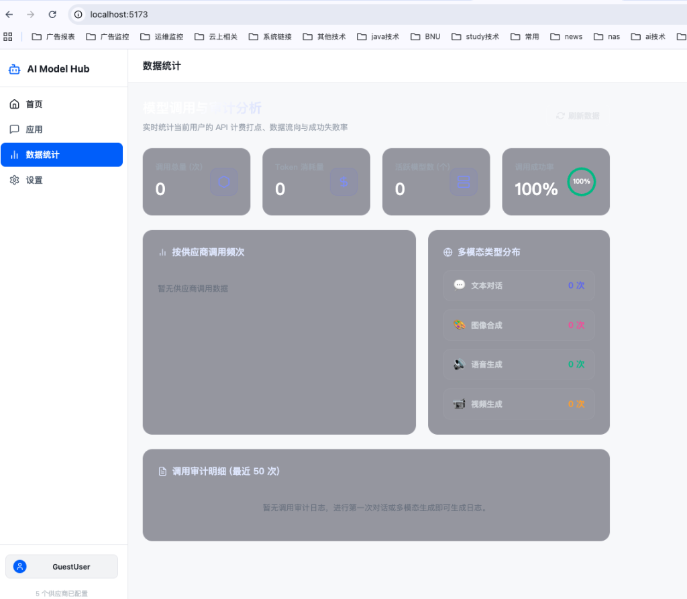
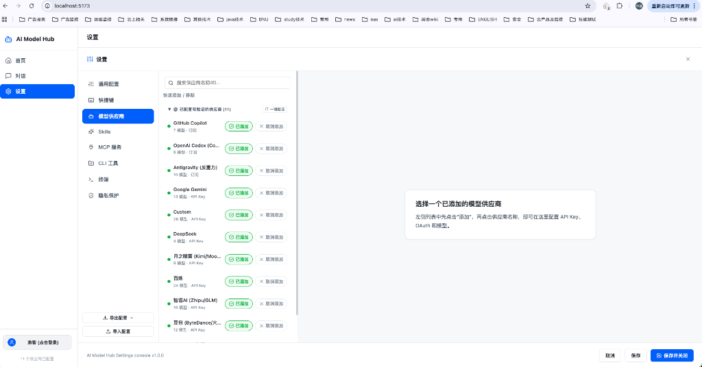
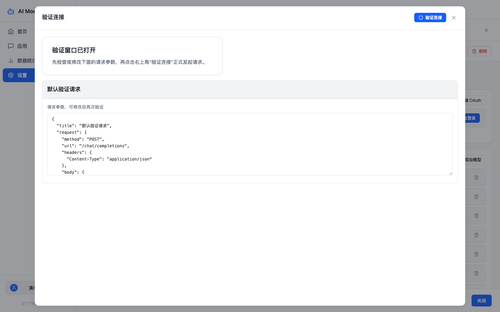
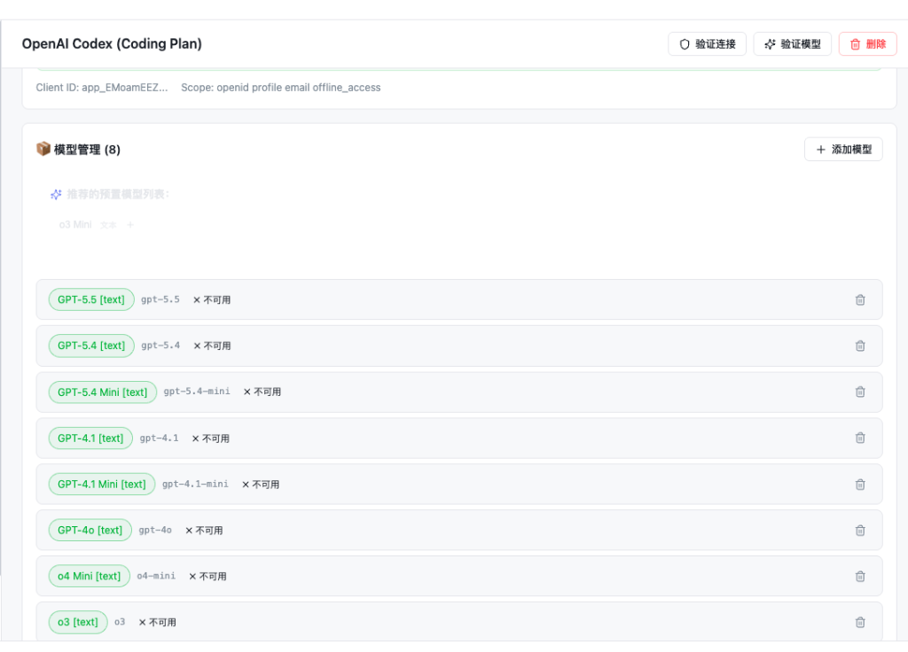
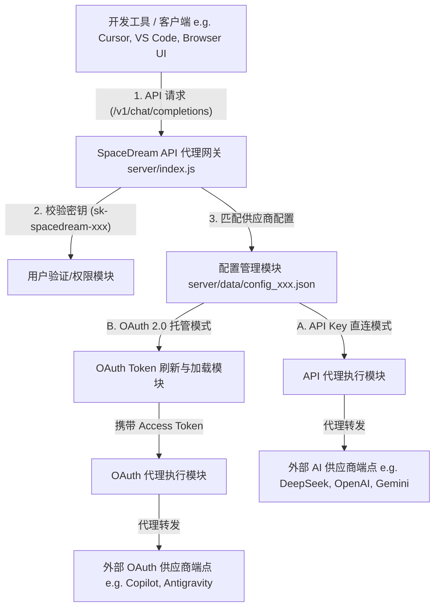
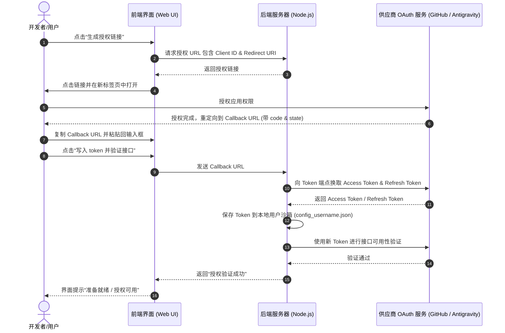

# SpaceDream AI Model Hub (多模型集成与 API 代理网关)

<p align="left">
  
  
  
  
</p>

SpaceDream AI Model Hub 是一个现代化、美观且高可用的多大语言模型集成管理平台。它不仅提供统一 Web 用户界面用于配置和测试各类国内外主流大模型供应商，还内置了**外部 API 代理网关**，支持通过标准的 OpenAI API 格式将所有配置好的模型聚合导出，提供给 Cursor、VS Code Copilot 等外部工具使用。

> **English:** A modern, sleek AI Model Hub & API Proxy Gateway supporting OpenAI, Claude, Gemini, DeepSeek, and more. Integrates via API Key, Token, or OAuth 2.0. Exposes all active models through a unified OpenAI-compatible API format for easy integration into Cursor, VS Code, and other development tools.

---

## 🛠️ 安装与部署指南

### 前提条件
- **系统环境**：Linux (CentOS / Ubuntu / Debian) 或 macOS。
- **权限要求**：自动安装 Node.js 需要 `sudo` 或以 `root` 用户运行。

---

### 1. 生产环境一键部署与管理 (推荐 🚀)

在服务器上，赋予部署脚本执行权限后：

```bash
chmod +x deploy.sh
```

您可以使用以下命令对服务进行管理和自动升级：

* **`./deploy.sh start`**：直接在后台启动（或 PM2 开启）服务进程。
* **`./deploy.sh stop`**：强制关闭服务进程（自动识别 PM2 或 `nohup` 后端监听端口）。
* **`./deploy.sh restart`**：直接重启服务。
* **`./deploy.sh status`**：查看当前服务的运行状态、PID 占用及最新日志。
* **`./deploy.sh`** (或 **`./deploy.sh upgrade`** / **`./deploy.sh deploy`**)：执行自动升级部署，包含以下步骤：
  1. **拉取代码**：自动 `git pull` 拉取最新的代码并升级。
  2. **检测环境**：检测 Node.js 运行环境（低于 `v18` 自动升级至 `v20 LTS`）。
  3. **安装依赖**：一键自动安装服务端和前端客户端（Vite）的所有 `node_modules` 依赖项。
  4. **编译打包**：使用 Vite 构建前端静态资源输出至 `client/dist`。
  5. **服务热启动**：自动热重启后端服务（PM2 零停机热更，或 `nohup` 自动断旧启新）。

---

### 2. 本地开发调试运行

若要在本地启动开发模式，支持代码热更新（Hot Reload）：

```bash
# 1. 克隆/拉取代码到本地

# 2. 一键安装前后端所有依赖项
npm run install:all

# 3. 运行开发服务器 (开发端口：前端 Vite 5174，后端 API 5173)
npm run dev
```

---

## 🖥️ 页面预览

| 📊 数据仪表盘与调用统计 | ⚙️ 供应商快速配置面板 |
| :---: | :---: |
|  |  |
| **🔐 三步式 OAuth 授权绑定** | **🧬 预置多模态模型校验** |
|  |  |

---

## 🌟 核心功能

1. **三合一多模式身份验证**：支持 `API Key` 直连、`Token` 验证以及标准 `OAuth 2.0`（GitHub Copilot/Codex/Antigravity）授权绑定。
2. **多模态模型集成**：已预置集成 OpenAI、Claude (Anthropic)、Google Gemini、DeepSeek (深度求索)、Kimi (月之暗面)、通义千问 (百炼)、字节豆包 (火山方舟)、智谱 GLM、MiniMax (海螺)、SiliconFlow、Groq 等主流渠道。
3. **一键智能验证**：
   - **一键验证链接**：一键检测配置的接口及网络连通性。
   - **一键验证模型**：自动遍历验证供应商支持的全部模型，并提供可视化的 **高级毛玻璃进度条**。
4. **外部 API 代理网关 (Proxy Service)**：
   - 统一代理端点：`http://localhost:5173/v1/chat/completions`。
   - 统一密钥格式：`sk-spacedream-<username>` (如 `sk-spacedream-dddd`)。
   - 智能路由：不同供应商的同名模型自动添加前缀区分（如 `openai-gpt-4o` 与 `github_copilot-gpt-4o`），支持外部工具无缝接入。
5. **一键自动部署 (Self-healing)**：部署脚本包含 Node.js 运行环境自动检测与升级逻辑，无痛迁移与部署上线。

---

## 🧬 代理网关架构与认证流程

### 1. 整体网关架构设计

SpaceDream AI Model Hub 作为一个集成网关，它扮演了客户端（如 Cursor、Python SDK）与各大模型供应商（如 OpenAI、GitHub Copilot、DeepSeek）之间的透明代理。

下面的架构图展示了请求流向及身份认证的校验机制：



### 2. 供应商认证流程

平台支持三种认证方式，其验证流程各不相同：

#### A. API Key 直连模式 (直连认证)
- **原理**：用户输入供应商提供的 API Key，后端直接将其加密保存在用户沙箱中。在代理外部工具调用时，网关读取该 API Key 并在 HTTP 请求头中附加（如 `Authorization: Bearer <API_KEY>` 或 `x-api-key: <API_KEY>`），直接与供应商通信。
- **适用平台**：OpenAI, DeepSeek, Claude, Google Gemini, Kimi, 通义千问, 字节豆包等。

#### B. Token 令牌模式
- **原理**：直接使用会话级别的 Bearer 令牌或临时 Token，同样在代理时直接附加至请求头中。
- **适用平台**：部分需要临时授权的开发通道。

#### C. OAuth 2.0 授权托管模式
- **原理**：通过 GitHub OAuth 或 Antigravity 模拟授权，使用 OAuth 换取的 Access Token 和 Refresh Token 进行身份认证，并支持自动刷新过期 Token。
- **时序交互流程图**：



---

## ⚙️ 配置说明

### 环境变量 (`.env` 或 `.env.local`)
您可以在项目根目录中创建 `.env.local` 配置文件，用于预置服务端口及平台 API 密钥：

```bash
# 服务运行端口 (默认 5173)
PORT=5173

# 供应商 API 密钥 (选填，预置后 UI 界面无需再次输入即可直接使用)
OPENAI_API_KEY=your_openai_key
MOONSHOT_API_KEY=your_kimi_key
ANTHROPIC_API_KEY=your_anthropic_key
GOOGLE_API_KEY=your_gemini_key
DEEPSEEK_API_KEY=your_deepseek_key
DASHSCOPE_API_KEY=your_qwen_key
```

---

## 📖 运行与使用指南

服务部署成功后，通过浏览器访问 `http://<您的服务器IP>:5173`：

### 1. 登录与多用户切换
- 输入用户名（如 `dddd`）并配置密码。系统为每个用户保留**相互隔离**的配置沙箱。
- 登录后，您可以在右侧点击用户名修改密码。

### 2. 供应商状态栏一键验证
- **生成授权链接 (OAuth)**：点击后会在按钮下方实时展示提示，授权成功后可直接使用。
- **一键验证链接**：检测当前供应商的 baseUrl 连通性，按钮上方展示高级磨砂质感加载进度条。
- **一键验证模型**：批量测试该供应商下支持的所有模型是否可用，按钮旁实时展示验证比例（如 `[5/10] 50%`）。

### 3. 使用外部 API 代理服务 (Proxy)
1. 点击主界面上方的 **"外部 API 代理服务"** 标签页。
2. 查看当前可用的统一 API 代理端点、您的 API Key、以及支持调用的模型列表。
3. **Cursor 配置示例**：
   - 打开 Cursor 设置 -> Models -> OpenAI API Section。
   - Override Base URL 填写：`http://<您的服务器IP>:5173/v1`。
   - API Key 填写：`sk-spacedream-dddd` (以实际用户名为准)。
   - 勾选或添加您想要调用的模型（如同名模型可使用 `github_copilot-gpt-4o` 形式）。

---

## 👥 作者与联系方式

- **作者**：dawn (SpaceDream)
- **联系方式 (QQ)**：44210509
- **说明**：如果您在使用、部署或二次开发中遇到任何问题，欢迎通过 QQ 与我联系交流。
